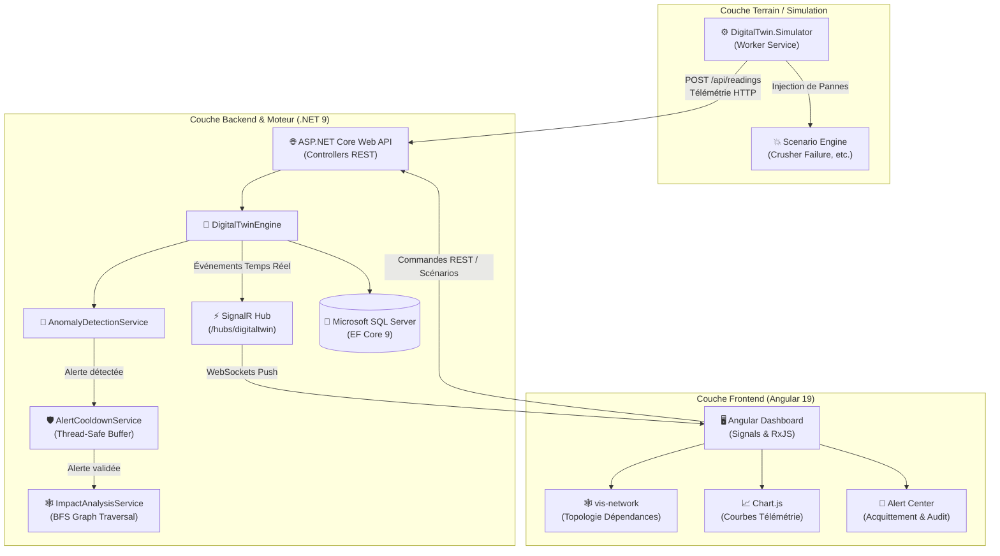

# 🏭 Industrial Digital Twin — OCP Phosphate Processing Plant
### 🌐 Système de Jumeau Numérique Temps Réel, Détection Prédictive d'Anomalies & Analyse d'Impact en Cascade

<p align="center">
  
  
  
  
  
  
  
  
</p>

---

## 📌 Sommaire
- [📖 À Propos du Projet](#-à-propos-du-projet)
- [✨ Fonctionnalités Clés](#-fonctionnalités-clés)
- [🏛️ Architecture du Système](#️-architecture-du-système)
  - [Principes Architecturaux](#principes-architecturaux)
  - [Diagramme de Flux Global](#diagramme-de-flux-global)
  - [Structure du Repository](#structure-du-repository)
- [⚙️ Stack Technologique](#️-stack-technologique)
- [🧠 Algorithmes & Moteurs Métier](#-algorithmes--moteurs-métier)
  - [1. Moteur d'Analyse d'Impact en Cascade (Algorithme BFS)](#1-moteur-danalyse-dimpact-en-cascade-algorithme-bfs)
  - [2. Système Anti-Rebond (Alert Cooldown)](#2-système-anti-rebond-alert-cooldown)
  - [3. Détection d'Anomalies Multi-Seuils](#3-détection-danomalies-multi-seuils)
- [🚀 Démarrage Rapide](#-démarrage-rapide)
  - [Prérequis](#prérequis)
  - [1. Configuration de la Base de Données & Backend API](#1-configuration-de-la-base-de-données--backend-api)
  - [2. Démarrage du Simulateur Industriel](#2-démarrage-du-simulateur-industriel)
  - [3. Démarrage du Dashboard Frontend Angular](#3-démarrage-du-dashboard-frontend-angular)
- [🧪 Tests & Qualité](#-tests--qualité)
- [📡 API & Hub SignalR](#-api--hub-signalr)
- [👥 Auteurs & Remerciements](#-auteurs--remerciements)

---

## 📖 À Propos du Projet

Dans le contexte de l'**Industrie 4.0** et des opérations minières/chimiques à flux continu du **Groupe OCP**, la disponibilité opérationnelle des chaînes de traitement de minerai de phosphate (criblage, concassage, lavage, flottation, séchage) est cruciale. Une défaillance mécanique imprévue sur une machine amont provoque des **arrêts en cascade** extrêmement pénalisants.

Ce projet implémente un **prototype complet de Jumeau Numérique Industriel (Digital Twin)** permettant :
1. **L'ingestion et la visualisation en temps réel** de la télémétrie multi-capteurs (vibrations, température, puissance, débit, pression).
2. **L'évaluation continue et proactive des anomalies** selon des règles multi-seuils dynamiques.
3. **L'analyse prédictive d'impact en cascade** grâce à un algorithme de parcours de graphe (**BFS avec détection de cycles**) sur la topologie des lignes de production.
4. **La simulation déterministe d'usines** et l'injection de scénarios de panne progressive (ex: dégradation de roulements sur concasseur primaire).

---

## ✨ Fonctionnalités Clés

- ⚡ **Télémétrie Temps Réel Sub-seconde (~45 ms)** : Ingestion et diffusion instantanée des mesures capteurs via **WebSockets (SignalR)**.
- 🎯 **Moteur de Détection Multi-Seuils** : Classification instantanée des états (`Normal`, `Warning`, `Critical`) avec seuils configurables par machine et type de capteur.
- 🛡️ **Régulation Anti-Rebond (*Alert Cooldown*)** : Suppression thread-safe du spam d'alertes via fenêtres temporelles glissantes (`ConcurrentDictionary`).
- 🕸️ **Cartographie & Analyse d'Impact Graph** : Modélisation topologique de l'usine sous forme de **graphe orienté de dépendances** avec simulation en temps réel des répercussions directes et indirectes.
- 🏭 **Simulateur d'Usine & Injection de Pannes** : Microservice autonome reproduisant le comportement physique des équipements et permettant de déclencher des scénarios d'avarie progressive en direct.
- 📊 **Tableau de Bord Réactif & Interactif (Angular 19 Signals)** :
  - Visualisation topologique interactive du réseau de machines (**vis-network**).
  - Graphiques de télémétrie temps réel et historiques (**Chart.js / ng2-charts**).
  - Gestion, acquittement et filtrage multicritères des alertes industrielles.
  - Métriques globales OEE (TRS), disponibilité et criticité de l'usine.

---

## 🏛️ Architecture du Système

### Principes Architecturaux
Le backend est architecturé selon les principes stricts de la **Clean Architecture** (Architecture Hexagonale / Oignon) et du **Domain-Driven Design (DDD)**, orchestré par le pattern **CQRS** via **MediatR** :

```
┌────────────────────────────────────────────────────────┐
│               DigitalTwin.Api (Presentation)           │
│   Controllers, Swagger, SignalR Hubs, Middlewares      │
└───────────────────────────┬────────────────────────────┘
                            │
┌───────────────────────────▼────────────────────────────┐
│          DigitalTwin.Application (Use Cases)           │
│   Commands, Queries, Handlers (MediatR), DTOs, Mappers │
└─────────────┬────────────────────────────┬─────────────┘
              │                            │
┌─────────────▼──────────────┐ ┌───────────▼─────────────┐
│  DigitalTwin.Infrastructure │ │   DigitalTwin.Domain    │
│  EF Core 9, SQL Server,     │ │   Entities, Value Objects│
│  SignalR Publishers, Repos  │ │   Events, Interfaces    │
└────────────────────────────┘ └─────────────────────────┘
```

### Diagramme de Flux Global



### Structure du Repository

```bash
Digital-Twin/
├── backend/
│   ├── DigitalTwin.slnx                     # Solution .NET 9
│   ├── DigitalTwin.Api/                     # API REST, SignalR Hubs & Configuration
│   ├── DigitalTwin.Application/             # Cas d'usage CQRS, Handlers MediatR, DTOs
│   ├── DigitalTwin.Domain/                  # Entités riches, Value Objects, Domain Events
│   ├── DigitalTwin.Domain.Tests/            # 83 tests unitaires automatisés (xUnit)
│   ├── DigitalTwin.Infrastructure/          # DbContext EF Core, SQL Server, Services I/O
│   └── DigitalTwin.Simulator/               # Worker de simulation & scénarios de panne
├── frontend/                                # Application Angular 19 Standalone
│   ├── src/
│   │   ├── app/
│   │   │   ├── core/                        # Services SignalR, API HTTP, Interceptors
│   │   │   ├── features/                    # Dashboard, Machines, Alertes, Topologie
│   │   │   ├── layout/                      # Navigation, Sidebar, Headers
│   │   │   └── shared/                      # Composants UI, Pipes, Modèles
│   │   └── package.json
│   └── tailwind.config.js
└── report_latex/                            # Rapport d'ingénierie complet en LaTeX
```

---

## ⚙️ Stack Technologique

| Domaine | Technologie | Rôle & Usage |
| :--- | :--- | :--- |
| **Backend Framework** | **.NET 9 / C# 13** | Cœur applicatif haute performance et asynchrone |
| **Architecture** | **Clean Architecture + DDD** | Séparation stricte des responsabilités et modèle métier isolé |
| **Pattern Médiateur** | **MediatR 12** | Découplage Commandes / Requêtes (CQRS) |
| **Temps Réel** | **ASP.NET Core SignalR** | Diffusion bi-directionnelle WebSockets à faible latence |
| **Persistance / ORM** | **Entity Framework Core 9** | Code-First migrations, requêtage optimisé LINQ |
| **Base de Données** | **Microsoft SQL Server** | Stockage persistant des séries temporelles, alertes et topologie |
| **Frontend Framework** | **Angular 19** | Architecture modulaire basée sur les *Signals* et composants réactifs |
| **Styling & Design** | **Tailwind CSS 3.4** | Système de design moderne, sombre et responsive |
| **Graphes & Topologie** | **vis-network 10** | Rendu interactif du graphe de dépendances industrielles |
| **Visualisation Données** | **Chart.js 4 & ng2-charts** | Graphiques dynamiques multi-axes de télémétrie |
| **Icônes** | **lucide-angular** | Iconographie industrielle vectorielle |
| **Tests & Qualité** | **xUnit, FluentAssertions, Moq**| Suite complète de 83 tests unitaires |
| **Documentation API** | **Swagger / OpenAPI 7** | Exploration et test interactif des endpoints REST |

---

## 🧠 Algorithmes & Moteurs Métier

### 1. Moteur d'Analyse d'Impact en Cascade (Algorithme BFS)
Lorsqu'une machine bascule en état critique (`Critical`), l'algorithme parcourt le graphe orienté des dépendances de l'usine :
- **Parcours en Largeur (Breadth-First Search - BFS)** par niveau de profondeur.
- **Calcul de sévérité dégressive** selon l'éloignement de la source ($S_{\text{impact}} = f(\text{Profondeur}, \text{Type})$).
- **Prévention robuste des boucles infinies** grâce à un registre d'états visités `HashSet<Guid>`.

### 2. Système Anti-Rebond (*Alert Cooldown*)
Pour éviter l'engorgement du réseau par saturation d'alertes identiques lors d'oscillations aux limites de seuils :
- Maintien en mémoire d'une fenêtre de cooldown par capteur (`SensorId`).
- Implémentation thread-safe via `ConcurrentDictionary<Guid, DateTime>`.
- Filtrage automatique des alertes redondantes émises dans un intervalle $< \Delta t_{\text{threshold}}$.

### 3. Détection d'Anomalies Multi-Seuils
Chaque mesure de télémétrie ($v$) est analysée par rapport aux spécifications physiques du capteur :
$$\text{Status} = \begin{cases} 
\text{Critical} & \text{si } v \ge \text{Threshold}_{\text{CritHigh}} \lor v \le \text{Threshold}_{\text{CritLow}} \\
\text{Warning} & \text{si } v \ge \text{Threshold}_{\text{WarnHigh}} \lor v \le \text{Threshold}_{\text{WarnLow}} \\
\text{Normal} & \text{sinon}
\end{cases}$$

---

## 🚀 Démarrage Rapide

### Prérequis
- **.NET SDK 9.0+** : [Télécharger .NET 9](https://dotnet.microsoft.com/download/dotnet/9.0)
- **Node.js (v20+) & npm** : [Télécharger Node.js](https://nodejs.org/)
- **Angular CLI v19** : `npm install -g @angular/cli`
- **SQL Server** (LocalDB, Express ou Docker instance)

---

### 1. Configuration de la Base de Données & Backend API

```powershell
# 1. Se positionner dans le dossier de l'API
cd "backend/DigitalTwin.Api"

# 2. Vérifier/Adapter la chaîne de connexion dans appsettings.json si besoin
# (Par défaut configuré pour SQL Server LocalDB / instance locale)

# 3. Appliquer les migrations Entity Framework Core
dotnet ef database update --project ../DigitalTwin.Infrastructure

# 4. Lancer l'API Backend
dotnet run
```
> 📍 **API & Swagger disponible sur :** `http://localhost:5000` ou `https://localhost:5001/swagger`  
> ⚡ **Hub SignalR disponible sur :** `https://localhost:5001/hubs/digitaltwin`

---

### 2. Démarrage du Simulateur Industriel

Dans un nouveau terminal :
```powershell
# Se positionner dans le dossier du Simulator
cd "backend/DigitalTwin.Simulator"

# Lancer la simulation d'usine
dotnet run
```
> Le simulateur commence immédiatement à générer et envoyer des flux de télémétrie réalistes vers l'API.

---

### 3. Démarrage du Dashboard Frontend Angular

Dans un troisième terminal :
```powershell
# Se positionner dans le dossier frontend
cd "frontend"

# Installer les dépendances
npm install

# Démarrer le serveur de développement Angular
npm start
```
> 🖥️ **Dashboard accessible sur :** `http://localhost:4200`

---

## 🧪 Tests & Qualité

Le projet dispose d'une couverture de tests rigoureuse validant les règles métier, la logique DDD, les handlers MediatR et les algorithmes de détection d'impact :

```powershell
# Exécuter l'ensemble des tests unitaires
dotnet test "backend/DigitalTwin.Domain.Tests"
```

```
Passed!  - Failed:     0, Passed:    83, Skipped:     0, Total:    83, Duration: 450 ms
```

---

## 📡 API & Hub SignalR

### Endpoints REST Principaux
| Méthode | Endpoint | Description |
| :--- | :--- | :--- |
| `GET` | `/api/plants` | Récupérer la hiérarchie complète des usines et lignes |
| `GET` | `/api/machines` | Lister les machines avec leur état temps réel |
| `GET` | `/api/machines/{id}/topology` | Obtenir le sous-graphe de dépendance de la machine |
| `POST`| `/api/readings` | Ingestion d'une mesure de télémétrie capteur |
| `GET` | `/api/alerts` | Consulter les alertes actives et filtrées |
| `POST`| `/api/alerts/{id}/acknowledge`| Acquitter une alerte opérateur |
| `POST`| `/api/simulator/scenario/crusher-failure` | Déclencher le scénario de panne concasseur |

### Événements SignalR (`/hubs/digitaltwin`)
- `ReceiveSensorReading` : Diffusion temps réel de chaque nouvelle mesure capteur.
- `ReceiveMachineStatusChanged` : Notification de transition d'état d'une machine.
- `ReceiveNewAlert` : Émission instantanée d'une nouvelle alerte avec calcul d'impact.

---


---
<p align="center">
  <b>Industrial Digital Twin Platform</b> • Bâtir l'usine intelligente de demain 🚀
</p>
